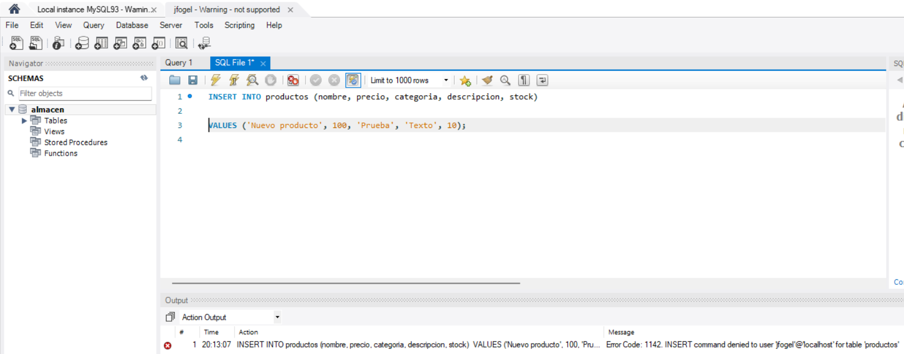

1. Si tengo una tabla de estudiantes y otra de cursos, donde los estudiantes estan incriptos a un curso, podría generar un problema si intento eliminar un estudiante que ya está inscripto en uno o más cursos. Eso generaría una violación a la integridad referencial.
Esto lo podemos solucionar agregando ON DELETE RESTRICT que no nos dejaria eliminar el estudiante si tiene inscripciones activas en la tabla cursos.

***

2. Creamos una tabla llamada matriculas, que tiene una clave foránea hacia la tabla estudiantes. Esta restricción sirve para garantizar que solo se puedan registrar inscripciones de estudiantes que realmente existen en la base de datos.

***

3. En este ejercicio simulamos que dos usuarios intentan modificar al mismo tiempo el saldo de una cuenta. Para evitar errores en los datos usamos el nivel de aislamiento SERIALIZABLE, el cual debería evitar que las dos transacciones trabajen sobre el mismo dato al mismo tiempo. Pero para que funcione bien, se necesita usar SELECT saldo FROM cuentas WHERE id = 1 FOR UPDATE para que el registro quede bloqueado y así evitar que otra transacción lo lea o lo modifique hasta que se haga el COMMIT.

<table>
  <tr>
    <td></td>
    <td></td>
  </tr>
</table>

<table>
  <tr>
    <td></td>
    <td></td>
  </tr>
</table>

***

4. Creamos la tabla con productos:

<td></td>

Luego creamos un procedimiento para que se inserten  100.000 registros:

<td></td>

Creamos un indice en la columna nombre:

<td></td>

Ejecutamos de nuevo la consulta para ver el tiempo de respuesta:

<td></td>

***

5. Creamos una consulta que filtra por múltiples columnas: categoria, stock y precio. Primero se ejecutó sin ningún índice, luego con diferentes índices (simples y compuestos), y se compararon usando EXPLAIN.

<td></td>

<td></td>

<td></td>

<td></td>

<td></td>

***

6. Primero creamos la tabla ventas, luego la vista resumen_mensuales que agrupa las ventas por producto, mes y año. Luego mostramos los 5 productos más vendidos:

<td></td>

<td></td>

<td></td>

***

7. Primero creamos un nuevo usuario:

<td></td>

Luego le damos permisos de lectura:

<td></td>

Finalmente, probamos el acceso para ver los productos:

<td></td>

Por ultimo muestra error a la hora de insertar un producto:

<td></td>

***